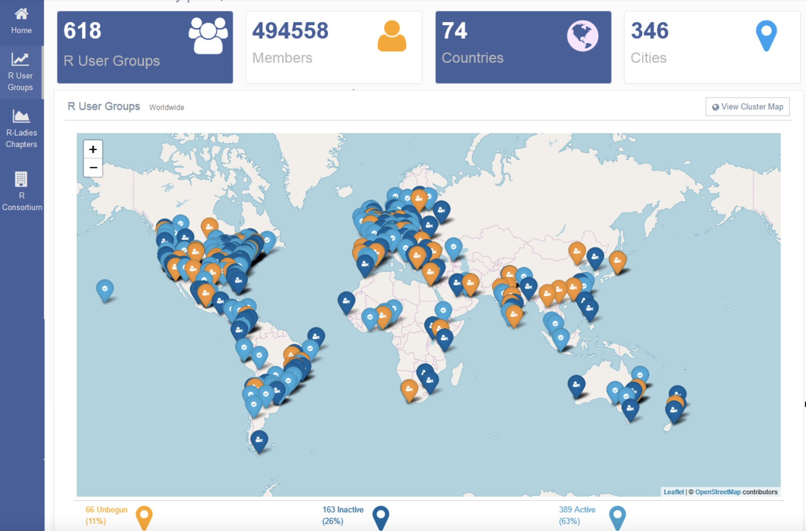
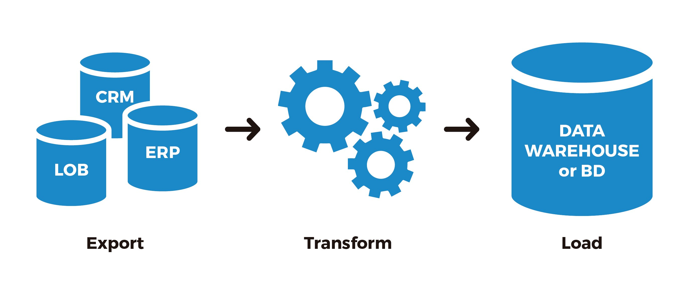
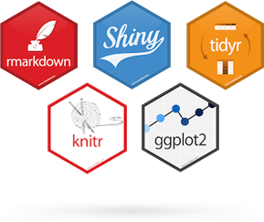
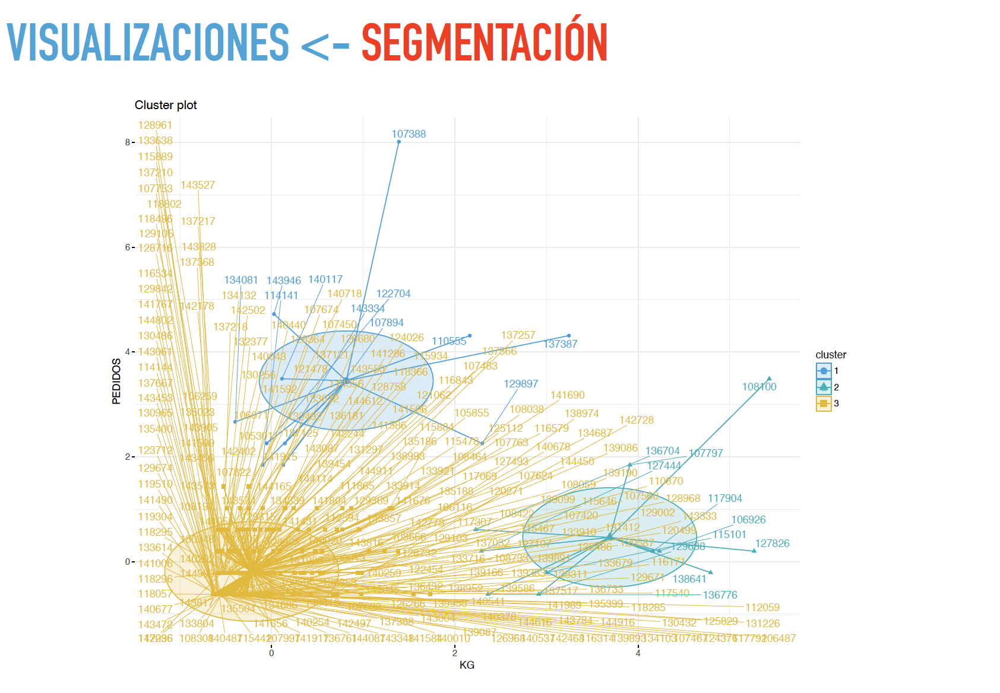

**R** es un poderoso lenguaje de
programación implementado como software libre
inicialmente orientado a usuarios del mundo de la
estadística. Con el transcurso del tiempo se ha
vuelto una de las principales opciones para el
procesamiento de los datos trayendo de manera
implícita que los avances alcanzados sirvan para
distintas áreas del conocimiento siendo una de
estas la Inteligencia de Negocios donde se
identifican grandes potencialidades para ser
usado como una herramienta para los procesos
de Extracción, Transformación y Carga (ETL), la
construcción de cuadros de mando (dashboards),
visualizaciones y funcionalidades de minería de
datos, ahorrando costos en adquisición de
licencias y dando una gran libertad al usuario en 
moldear el producto acorde a sus necesidades.

{width=150px height=150px align=right}


### I. EL INICIO: DESPUÉS DE S VIENE R
El lenguaje R inicialmente estaba destinado
principalmente a la manipulación, simulación, cálculo y
graficación de datos [1] . Sus orígenes se encuentran en la
implementación de una versión libre del lenguaje de
programación S el cual se orientaba a cálculos estadísticos.
El proyecto R fue iniciado por Robert Gentleman y
Ross Ihaka del departamento de Estadística en la Universidad
de Auckland en 1995. El desarrollo de R funciona en
simultáneo como un software y lenguaje de programación.
R es distribuido bajo los términos del GNU General
Public Licence (Licencia Pública General de GNU)
garantizando la libertad de usar, copiar y modificar el
software.
Que su sintaxis resulte sencilla y directa para el
usuario final, el entorno de desarrollo en que se ejecuta, sus
velocidades de procesamiento, que sea un lenguaje
interpretado, lo que lleva a que al tipear un comando sea
directamente ejecutado sin la necesidad de construir-compilar
completo el programa, entre otros factores, han hecho que
este lenguaje haya ganando adeptos para muchos usos que van
más allá de la estadística, siempre y cuando su aplicación
tenga que ver con el procesamiento de datos.

### II. USO ACTUAL
Este lenguaje se ha convertido en uno de los más
usados en lo concerniente a los datos, llegando a estar paralelo
al Python en cantidad de usuarios para dicha finalidad. La
encuesta anual hecha por el sitio de internet KDnuggets en
2018 lo sitúa como el tercer software con más usuarios en la
comunidad de analítica, ciencia de datos y aprendizaje
automatizado [2] . Puede ser instalado en los sistemas
operativos Linux, Windows y MacOS. La versión más
reciente disponible es la 3.5.2 .

#### A. Comunidad R

{width=90% height=250px}

El lenguaje R funciona con la filosofía de software
libre con código abierto lo que hace que los desarrollos y
aplicaciones que se implementan son altamente contributivos
entre la comunidad de usuarios.
Los usuarios pueden crear paquetes que faciliten la
ejecución de procesos. El sitio de internet www.r-project.org
es el principal repositorio de desarrollos que se distribuyen en
forma de paquetes. Actualmente sólo en este sitio se
encuentran más de trece mil paquetes que abarcan distintas
utilidades como pueden ser procesamiento de datos crudos,
graficación de mapas, algoritmos de aprendizaje automatizado
entre muchos otros. Igualmente existe una diversidad de sitios
donde se almacenan otros paquetes pudiendo citar la página
del proyecto Bioconductor que contiene paquetes que son
usados en la investigación del genoma [3] . Es importante que
sepamos que todos estos paquetes están disponibles para libre
uso de la comunidad de manera libre y sin ninguna
correspondencia de pago .

#### B. Entornos de desarrollo ; R-Studio
Para este lenguaje se disponen pocas opciones de
entorno de desarrollo integrado (IDE) siendo algunas de ellas:

###### 1) R Studio

###### 2) Eclipse

###### 3) Visual Studio for R
<br>

{width=20% height=20%, align=left}

La primera de las opciones es la más conocida y es
ampliamente usada por la facilidad que representa la
visualización de todo el entorno de paquetes, variables,
consola y editor para el usuario. Este entorno de desarrollo fue
lanzado en 2011 y pertenece a la compañía rstudio.inc . Sus
versiones para usuario final son libre y de código abierto,
aunque también ofrecen versiones para ser instaladas en
servidores de la propia compañía que sí tienen costos
asociados.
Particularmente este IDE representa un tópico de
gran interés para esta investigación ya que el software permite
la ejecución exclusiva de una serie de paquetes que facilitan la
generación de tableros y cuadros de control que en conjunto
con gráficas constituyen los dashboards que serán abordados
más adelante en este trabajo.

### III. R PARA INTELIGENCIA DE NEGOCIOS

Si entendemos la Inteligencia de Negocios (I.N.) como el
conjunto de procesos mediante los cuales buscamos extraer
conocimiento de los datos para convertirlos en información
que de sustento a la toma de decisiones por parte de los
gerentes de una organización podemos proyectar que el
lenguaje R representa una sólida opción en los procesos que
se incluyen dentro del área de la Inteligencia de Negocios.
Hay que ser muy enfáticos en aclarar que la implementación
de cualquier proceso de I.N. será muy distinto a como se hace
en las plataformas tradicionales como por ejemplo Pentaho,
Tableau, Power BI, ya que este tipo de softwares en gran
medida facilitan al diseñador y programador de la solución
una gran cantidad de pasos mediante las herramientas de
programación visual o métodos similares los cuales difieren
radicalmente del proceso que se tendría que ejecutar en R.
Sin embargo las potencialidades de este lenguaje
permiten que todos los requerimientos del usuario final
puedan ser moldeados para dar cumplimiento a los demandas
más exigentes, ya que R cuenta con la capacidad de efectuar
todos los procesos necesarios y por la gran comunidad de
desarrolladores con que cuenta todo el tiempo se están
creando nuevas funcionalidades.
Al adoptar R como la base sobre la que se desarrolle
la solución de negocio se hará necesario que en el equipo de
trabajo se incluyan expertos en la programación de este
lenguaje. Posiblemente también sea necesario complementar
con otro lenguaje como PHP o Python algún requerimiento
que R no sea capaz de procesar pero sí de integrarse con estos
otros recursos.
A continuación vamos a listar los procesos de la I.N.
en los cuales R puede ser usado.

#### A. ETL-Extracción, Transformación y Carga

{width=80%}

La extracción de datos en R es viable ya que permite
la conexión con las más usadas bases de datos en Oracle,
mySQL, mariaDB, Postgree. El desarrollo de múltiples
paquetes da diversas opciones que permiten la conexión y
extracción deseada [4].
También es capaz de procesar una gran cantidad de
tipos de archivos que contengan datos como los provenientes
de excel, csv y cualquier otro estándar.
Posteriormente a la extracción este lenguaje tiene una
gran cantidad de opciones para hacer las transformaciones y
limpieza de los datos obtenidos con altos niveles de exigencia
y rendimiento.
Todas las transformaciones clásicas es posible
realizarlas como joins, uniones e intersecciones,
concatenaciones, procesamiento de expresiones regulares
-regex-, filtros, etc.
El almacenado de los datos procesados también
queda claro que es posible ejecutarlo en este lenguaje.

#### B .Visualizaciones:

Una de las mayores fortalezas que presenta este
lenguaje son las representaciones gráficas que se pueden hacer
ya que cuenta con varios sistemas gráficos altamente
desarrollados.
El uso de diversos paquetes facilita la generación de
reportes permitiendo visualizar roll ups y drill downs y
semejantes operaciones de agregación o disgregación de
datos.
Exportar los reportes a distintos formatos o su
visualización en entorno web son otros de los recursos con
que cuenta este lenguaje.

```{r, echo=FALSE}
library(cowplot)
library(ggplot2)

p1 <- ggdraw() + draw_image('images/shinydashboard.png', scale = .98)
p2 <- ggdraw() + draw_image('images/adminLTE2_dashboard.png', scale = .98)

plot_grid(p1, p2)

```

### IV. APLICACIONES EN R, EL NEGOCIO DE LA INTELIGENCIA DE NEGOCIOS

El hecho de que este software sea libre abre diversas
opciones para el desarrollo de soluciones y aplicaciones para
las empresas en el área de desarrollo informático en el campo
de la inteligencia de negocios. Es viable la obtención de
ingresos para una empresa de software tanto en el desarrollo
como en el mantenimiento de las aplicaciones. A diferencia de
algunos usos que se le puede dar a R para estudios puntuales
sobre distintas variables, la implementación de soluciones en
este campo implican el acompañamiento a la organización que
la adopta e igualmente el mantenimiento, adaptaciones y
mejoras al sistema donde claramente también estará incluido
el Dataware House.

### V. PAQUETES R DE UTILIDAD PARA LA I.N.:

>#### A. Tidyverse: es una colección de paquetes que permiten
generar una gran cantidad de procesos que inician con la carga
de los datos, las transformaciones que sean requeridas,
almacenamiento en formatos que R maneja de manera más
eficiente y las visualizaciones. Ha sido desarrollado por el
mismo equipo de Rstudio.inc. Todos estos paquetes usan una
gramática similar para darle coherencia a todo el proceso que
sea ejecutado. Esta colección está compuesta por: ggplot 2
(creación de gráficos), dplyr (manipulación de datos), tidyr
(organización de los datos), readr (lectura de archivos), purr
(uso de funciones y vectorizaciones para remplazar loops),
tible (almacenamiento de datos), strinr (procesamiento de
expresiones de textos) [6].


{width=90%, align=center}

>#### B. Shiny: 
Es un paquete que permite generar aplicaciones web
interactivas con visualización de reportes, tablas y gráficos en
el navegador web y permite al usuario interactuar con los
datos disponibles. Puede ser alojado bajo la modalidad standalone
o en un servidor [7].

>#### C. Radiant: 
Basado en shiny incrementa las potencialidades en
la visualización y procesamiento interactivo con el usuario de
los datos ya que se destina principalmente a la analítica de
negocios [8].

>#### D. mssqlR: 
Conexiones a distintas bases de datos con sintaxis
de MySQL Server [9]

>#### E.. knitr: 
Generación de informes integrados a procesos realizados en códigos de programación.

### VI. FRONTERA
Una vez realizados los clásicos procesos que
constituyen la I.N. El lenguaje R puede fácilmente ejecutar
procesos que siguen de forma natural para cualquier
organización que haya consolidado su plataforma. Podemos
mencionar los siguientes procesos:

#### A. Minería de datos

>##### 1) Análisis de segmentos: implementar algoritmos de
segmentación con los que se pueda entender cómo se
componen las agrupaciones por ejemplo de clientes de una
empresa. Saber cuáles clientes se parecen más unos que con
los otros.

{width=70%}

>##### 2) Regresiones lineales: por medio de estos procesos
de la estadística realizar predicciones sobre los valores que
pueda tener una determinada variable en el tiempo.


>##### 3) Clasificaciones : para determinado problema de
una organización donde sea necesario mediante una serie de
características, atributos, lograr efectuar una clasificación de
un ejemplo nuevo.

#### B. Big Data
R permite conectarse a servidores de las grandes
companías del cloud computing para ejecutar procesos
paralelos y distribuidos que funcionen en ambientes hadoop o
similares lo que brinda otra fortaleza en el escalamiento de las
necesidades de la organización.

### VII.CONCLUSIONES
R con toda claridad es un lenguaje que puede usarse en la
Inteligencia de Negocios pudiendo brindar múltiples
beneficios a los usuarios, no obstante es necesario que tanto
lops desarrolladores de aplicaciones en principio, como los
usuarios finales entiendan las ventajas y desafíos que plantea
el uso de R.
Para nuestro país o en situaciones presupuestarias de
empresas donde los recursos financieros son reducidos el
lenguaje R es una alternativa de bajo coste y alta eficiencia.
Para los desarrolladores de aplicaciones R también
constituye una posible fuente de ingreso a la que se le puede
sumar el mantenimiento de las plataformas que se
implementen.

### REFERENCIAS
[1] W.J. Owen, The R Guide Version 2.5, Department of Mathematics and
Computer Science, University of Richmond, 2010.

[2] Piatetsky, Gregory (2018) the 19 th anual Kdnuggets software pool
[online] Avaible: https://www.kdnuggets.com/2018/05/poll-tools-analyticsdata-
science-machine-learning-results.html

[3] (2019) Bioconductor Project. avaible: https://www.bioconductor.org

[4] Gendron, Jay, Introduction to R for Business Intelligence, Packt
Publishing, 2016.

[5] Barry Dwight, Business Intelligence with R, 2016.

[6] (2019) Tidyverse: a collection of R packages .Avaible:
https://www.tidyverse.org/

[7] (2019) Shiny: a R package for buid web apps. Avaible:
https://shiny.rstudio.com/

[8] (2019) A brower-based interfaced for Business Analytics. Avaible:
http://vnijs.github.io/radiant/

[9] (2019) A R package for query data from Mysql Server. Avaible:
https://cran.r-project.org/web/packages/mssqlR/index.html


