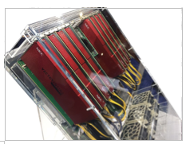
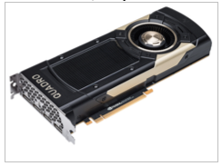
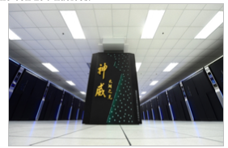
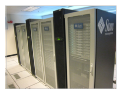
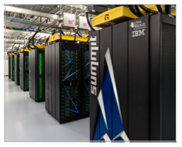

### I. INTRODUCCIÓN

La cantidad de datos que nuestra sociedad genera y dispone para procesar va creciendo cada día en forma exponencial. Igualmente surgen problemas de cálculo computacionales más complejos que resolver. Una manera de dar soluciones a estos problemas es el uso máquinas paralelas basadas en hardware. Estas máquinas ya cuentan con más de 55 años de hitoria y en el presente reporte vamos a hacer un repaso de tan interesante tópico.

Sabemos que existen problemas que para ser resueltos  demandan una gran cantidad de cálculos como lo es la modelación del movimiento de cuerpos en la astronomía o las predicciones climáticas por mencionar tan sólo algunos ejemplos. Las máquinas paralelas basados en hardware son una de las herramientas predilectas para intentar aproximarnos a encontrar una solución a problemas tan complejos ya que permiten ejecutar grandes cantidades de procesos de cálculo de manera simultanea. Bajo el principio de dividir y conquistar sabemos que grandes problemas pueden ser resueltos en bloques más pequeños al mismo tiempo.

Podemos definir un ordenador paralelo como un conjunto de procesadores que son capaces de trabajar de forma cooperativa para resolver un problema computacional. Esta definición es lo suficientemente amplia como para incluir superordenadores paralelos que tienen cientos o miles de procesadores, redes de estaciones de trabajo, estaciones de trabajo con múltiples procesadores y sistemas integrados. Las computadoras paralelas son interesantes porque ofrecen la posibilidad de concentrar recursos computacionales, ya sean procesadores, memoria o ancho de banda de E/S (entrada/salida), en problemas computacionales importantes.

### II. Tipos de sistemas paralelos.:
Según la Taxonomía de Flynn se clasifican a los sistemas según sus capacidades de procesamiento paralelo:

#### 1) Una secuencia de instrucciones y una secuencia de datos (SISD):

un único procesador interpreta una única secuencia de instrucciones. Los computadores monoprocesadores pertenecen a este grupo.

#### 2) Una secuencia de instrucciones y múltiples secuencias de datos (SIMD): 
una única instrucción controla paso a paso la ejecución simultanea y sincronizada de un cierto número de elementos de proceso. Ejemplo son las máquinas vectoriales.

#### 3) Múltiples secuencias de instrucciones y una secuencia de datos (MISD): 

cada procesador ejecuta una secuencia de instrucciones diferentes.

#### 4) Múltiples secuencias de instrucciones y múltiples secuencias de datos (MIMD): 

ejecutan procesos distintos con datos distintos de manera simultanea. Ejemplo es el procesamiento en clusters.

![imagen 1: organización de computadores según la taxonomía de Flynn [@1]](images/Screen Shot 2021-02-05 at 09.07.41.png){width=50%}

### III. Tipos de computadoras paralelas:

 1) Memoria compartida multiprocesador: se tienen multiples procesadores en un computador con multiples módulos de memoria de manera que cada procesador puede accede a cualquier modulo de memoria.
            
 2) Memoria distribuida multicomputador: cuando se tiene computadores completos, cada uno con su memoria y están interconectados por una red.

### IV. MAQUINAS ACTUALES:

#### A) Procesadores Vectoriales: 
Un procesador vectorial o procesador de matrices es una unidad central de procesamiento (CPU) que implementa un conjunto de instrucciones donde cada una opera en matrices unidimensionales de datos llamadas vectores, en comparación con los procesadores escalares, cuyas instrucciones operan en elementos de datos individuales. Los procesadores vectoriales pueden mejorar enormemente el rendimiento en determinadas cargas de trabajo, especialmente en la simulación numérica y en tareas similares como la simulación de espacios continuos donde se realizan de forma repetitiva operaciones aritméticas en coma flotante *floating points*. Las máquinas vectoriales aparecieron a principios de la década de 1970 y dominaron el diseño de supercomputadoras hasta la década de 1970. La rápida caída en la relación precio-rendimiento de los diseños de microprocesadores convencionales llevó a la desaparición del superordenador vectorial a finales de la década de 1990 no obtante aún existen algunas máquinas vectoriales.
Estas máquinas llevan aún más lejos la técnica de *“instruction pipelining”* ya que en lugar de canalizar sólo las instrucciones, también canalizan los datos en sí mismos. El procesador recibe instrucciones que dicen no sólo que hay que sumar A a B, sino que hay que sumar todos los números "de aquí a aquí" a todos los números "de allí a allí". En lugar de tener que decodificar constantemente las instrucciones y luego obtener los datos necesarios para completarlas, el procesador lee una sola instrucción de la memoria, y simplemente está implícito en la definición de la instrucción misma que la instrucción operará de nuevo en otro elemento de datos, en una dirección un incremento mayor que el último. Esto permite un ahorro significativo en el tiempo de decodificación.

A partir de 2015, la mayoría de las CPUs implementan arquitecturas que incluyen instrucciones para una forma de procesamiento vectorial en múltiples conjuntos de datos (vectorizados). Algunos ejemplos comunes son las instrucciones MMX, SSE y AVX de Intel x86, las extensiones 3DNow! de AMD, la extensión VIS de Sparc, AltiVec de PowerPC y MSA de MIPS. Las técnicas de procesamiento vectorial también funcionan en el hardware de la consola de videojuegos y en los aceleradores de gráficos. En 2000, IBM, Toshiba y Sony colaboraron para crear el procesador Cell.

Un ejemplo actual de este tipo de computadoras es el SX-Aurora TSUBASA de NEC  de la familia de arquitecturas SX de NEC. A diferencia de los anteriores superordenadores SX, el SX-Aurora TSUBASA se suministra como una tarjeta PCIe, denominada por NEC como un "Vector Engine". Se pueden insertar ocho tarjetas VE en un host vectorial (VH) que normalmente es un servidor x86-64 que ejecuta el sistema operativo Linux.

{width=100%}

#### B) GPGPU:
La computación de propósito general en las unidades de procesamiento gráfico (GPGPU) es el uso de una unidad de procesamiento gráfico (GPU), que normalmente se encarga de la computación sólo para gráficos por ordenador, para entonces realizar cálculos en aplicaciones que tradicionalmente se manejan en la unidad central de procesamiento (CPU). El uso de múltiples tarjetas de vídeo en un ordenador, o de un gran número de chips gráficos, paraleliza aún más la naturaleza ya de por sí paralela del procesamiento de gráficos. Además, incluso un único marco de trabajo de GPU-CPU proporciona ventajas que las múltiples CPUs por sí solas no ofrecen debido a la especialización en cada chip.

Esencialmente, un pipeline de GPGPU es una especie de procesamiento paralelo entre una o más GPUs y CPUs que analiza los datos como si estuvieran en imagen u otra forma gráfica. Aunque las GPU funcionan a frecuencias más bajas, suelen tener muchas veces más núcleos. Por lo tanto, las GPUs pueden procesar muchas más imágenes y datos gráficos por segundo que una CPU tradicional. La migración de datos a un formato gráfico y el uso de la GPU para escanearlos y analizarlos pueden crear una gran aceleración.

Los canales de la GPGPU se desarrollaron a principios del siglo XXI para el procesamiento de gráficos (por ejemplo, para mejorar los sombreadores). Se descubrió que estas pipelines se ajustaban bien a las necesidades de la informática científica, y desde entonces se han desarrollado en esta dirección. Hoy en encontramos que son de gran utilidad en las siguientes aplicaciones:

  • Transformaciones de fourrier
  • Clusters (agrupaciones) de computadoras o variants de computadores paralelos que son usadas para intensivas tareas de cálculo
  • Machine learning.
  • Logica difusa y muchas otras.

Un ejemplo de una GCPU muy poderosa actualmente es la NVIDIA QUADRO GV 100 con 5120 núcleos CUDA de procesamiento paralelo, una memoria GPU de 32 GB y un tensor performance de 118,5 tflops.

{width=100% }

#### C) Manycore Processors:
Los procesadores Manycore son procesadores multinúcleo de diseño especializado para un alto grado de procesamiento paralelo, los cuales  contienen un gran número de núcleos de procesamiento más simples e independientes (desde unas pocas decenas de núcleos hasta miles o más). Los procesadores Manycore se distinguen de los procesadores multinúcleo por estar optimizados desde el principio para un mayor grado de paralelismo explícito y para un mayor rendimiento (o un menor consumo de energía) a expensas de la latencia y un menor rendimiento de un solo hilo. Los procesadores Manycore se utilizan ampliamente en ordenadores embebidos y en ordenadores de alto rendimiento. A partir de noviembre de 2018, el tercer superordenador más rápido del mundo (según la lista TOP500), es el chino Sunway TaihuLight, que obtiene su rendimiento de 40.960 procesadores manycore SW26010, cada uno con 256 núcleos.

{width=80%}

#### D) Cluster de ordenadores:
Un clúster de ordenadores es un conjunto de ordenadores conectados entre sí de forma flexible o estrecha que trabajan juntos, de modo que, en muchos aspectos, pueden considerarse como un único sistema. A diferencia de las computadoras de red, los clusters de computadoras tienen cada nodo configurado para realizar la misma tarea, controlada y programada por software.

{width=80%}

Los componentes de un clúster suelen estar conectados entre sí a través de redes de área local rápidas, y cada nodo (ordenador utilizado como servidor) ejecuta su propia instancia de un sistema operativo. En la mayoría de los casos, todos los nodos utilizan el mismo hardware y el mismo sistema operativo, aunque en algunas configuraciones (por ejemplo, utilizando recursos de aplicaciones de clúster de código abierto (OSCAR)), se pueden utilizar diferentes sistemas operativos en cada ordenador, o bien hardware diferente.

El Solaris Cluster de Sun Microsystems es un ejemplo.

#### E) Procesadores multinúcleo:

Un procesador multinúcleo es aquel que combina dos o más microprocesadores independientes en un solo paquete, a menudo un solo circuito integrado. Un dispositivo de doble núcleo contiene solamente dos microprocesadores independientes. En general, los microprocesadores multinúcleo permiten que un dispositivo computacional exhiba una cierta forma del paralelismo a nivel de thread (thread-level parallelism) (TLP) sin incluir múltiples microprocesadores en paquetes físicos separados. Esta forma de TLP se conoce a menudo como multiprocesamiento a nivel de chip (chip-level multiprocessing) o CMP.
La gran mayoría de las computadoras personales actualmente cuentan con un procesador de este tipo.

SUPERCOMPUTADORES QUE USAN MAQUINAS PARALELAS
  • Xeon Phi es una serie de procesadores x86 manycore diseñados y fabricados por Intel. Está diseñado para su uso en supercomputadoras, servidores y estaciones de trabajo de gama alta. Su arquitectura permite el uso de lenguajes de programación estándar y APIs como OpenMP.

  • El Summit u OLCF-4  es un superordenador desarrollado por IBM para su uso en el OAK Ridge National Laboratory de Estados Unidos, que desde el 8 de junio de 2018 es el superordenador más potente del mundo. Su velocidad se sitúa en los 200 petaflops. Cada nodo tiene más de 600GB de memoria coherente (gran ancho de banda + DDR4 SDRAM) direccionable por todas las CPUs y GPUs más 800GB de RAM no volátil, que puede ser utilizada como búfer o memoria extendida.7​ Las CPUs Power9 y Volta GPUs están conectadas mediante el protocolo de alta velocidad NVLink de NVIDIA.  Esto permite un modelo de Computación Heterogénea

{width=110%}

COMPUTADORAS PERSONALES QUE USAN MAQUINAS PARALELAS
Neural Compute Stick
El Intel Movidius Neural Compute Stick (NCS) es un pequeño dispositivo de aprendizaje profundo sin ventilador que puede utilizar para aprender programación de IA en el borde. NCS funciona con la misma unidad de procesamiento Intel Movidius Vision Processing Unit (VPU) de bajo consumo y alto rendimiento que se puede encontrar en millones de cámaras de seguridad inteligentes, aviones teledirigidos por gestos, equipos de visión industrial y mucho más. Los frameworks soportados son Tensorflow y Caffe (software)

{width=100%, align=center}

>este reporte técnido fue escrito originalmente para la materia Sistemas Paralelos y Distribuidos de la Maestría en Ciencias de la Computación de la Facultad de Ciencias de la Universidad Central de Venezuela a cargo del prof. Dr. Andrés Sanoja.

### Bibliografía

---
references:
- id: 1
  title: Organización y Arquitectura de Computadores
  author: 
  - family: Stallings 
    given: William
  type: book
  publisher: Pearson
  issued:
    year: 2006
    month: 

- id: 2
  title: Parallel Programming Paradigms and Frameworks in Big Data Era
  author: 
  - family: Dobre 
    given: Ciprian
  type: artículo
  publisher: International Journal of Parallel Programming
  issued:
    year: 2014
    month: 

...
http://www.cs.csi.cuny.edu/~gu/teaching/courses/csc429/slides/slides1.pdf
https://www.mcs.anl.gov/~itf/dbpp/text/node6.html
https://en.wikipedia.org/wiki/Parallel_computing
https://en.wikipedia.org/wiki/NEC_SX-Aurora_TSUBASA
https://en.wikipedia.org/wiki/Vector_processor
https://www.nvidia.com/en-us/design-visualization/quadro-store/
https://en.wikipedia.org/wiki/Manycore_processor
https://en.wikipedia.org/wiki/Xeon_Phi
https://en.wikipedia.org/wiki/Computer_cluster
https://es.wikipedia.org/wiki/Procesador_multin%C3%BAcleo
https://es.wikipedia.org/wiki/Summit_(superordenador)

